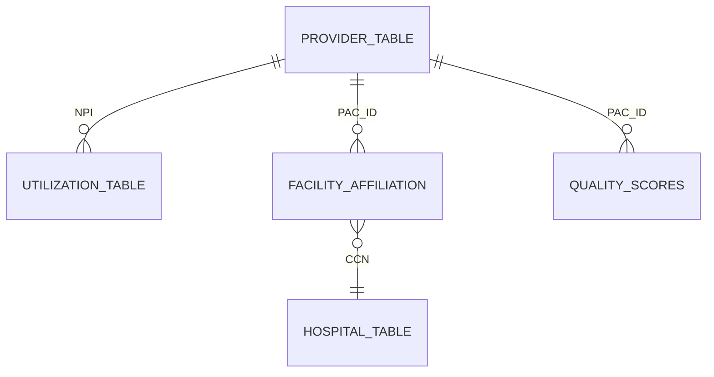

# UC07 Cognizant Provider Table Relationships

## Primary Keys Found
- **Total Unique NPIs across all tables**: 1677474
- **Total Unique PAC_IDs across all tables**: 1697103
- **Total Unique CCNs across all tables**: 0

## Observed Relationships
1. **Provider -> Facility (PAC_ID)**: 
   - `DAC_NationalDownloadableFile.csv` contains individual providers (keyed by PAC_ID/NPI).
   - `Facility_Affiliation.csv` maps PAC_ID to CCN (Facility/Hospital).
   - *Orphan PAC_IDs in Affiliation table (not in Provider table)*: 29

2. **Provider -> Utilization (NPI)**:
   - `Utilization.csv` maps NPIs to procedure volumes/HCPCS codes.
   
3. **Provider -> Quality (PAC_ID/NPI)**:
   - The MIPS and quality score tables (`ec_score_file.csv`) link back via PAC_ID to the primary provider table.

