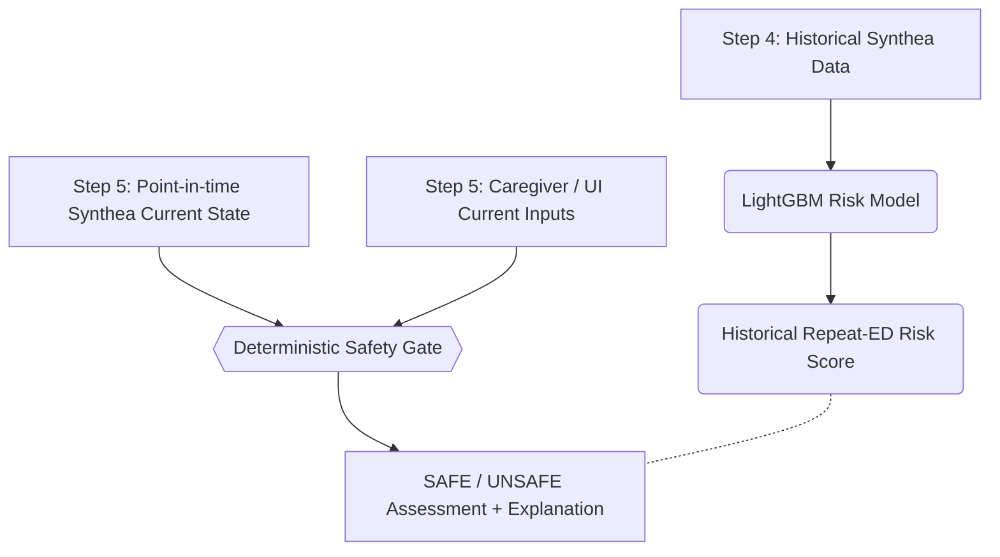

# UC07 Step 5: Current Clinical Context & Safety Gate Audit

This report details the read-only feasibility audit of the Synthea dataset to determine the architecture of the Deterministic Safety Gate.

## 1. Available Synthea Data for Step 5
Synthea provides robust point-in-time context including:
- **Active Conditions** (calculated via overlap logic)
- **Active Medications** (calculated via overlap logic)
- **Allergies** (though reaction severity is frequently missing)
- **Vitals / Observations** (recorded distinctly from historical context)
- **Encounter Context** (such as Reason Codes)

## 2. Representation of Current Clinical State
The current clinical state is defined strictly at the `INDEX_TIMESTAMP` (the START time of the ED Encounter).
- Information is valid for the Safety Gate **ONLY IF**: `Timestamp <= Decision Point`.
- Same-encounter vitals are acceptable **ONLY IF** they represent triage measurements (before or at the decision point). Treatment-phase vitals later in the same encounter are disallowed to prevent leakage.

## 3. Representation of Historical State
Historical state includes any event where `Timestamp < INDEX_TIMESTAMP`. This forms the basis of the Step-4 risk model and is completely isolated from the acute Step-5 rules.

## 4. Observations / Vitals Available
The following key vitals are natively generated by Synthea and available for rules:
- Diastolic/Systolic Blood Pressure (mmHg)
- Heart Rate (/min)
- Respiratory Rate (/min)
- Body Weight/Height/BMI
- Pain Severity (0-10)
- Oxygen Saturation (SpO2)

## 5. Active Conditions
Active conditions can be deterministically calculated by ensuring `START <= INDEX_TIMESTAMP` and `(STOP IS NULL OR STOP > INDEX_TIMESTAMP)`. Synthea correctly utilizes NULL stops for lifelong chronic conditions (e.g., Diabetes, Hypertension).

## 6. Active Medications
Similar to conditions, active medications are identified using the Start/Stop interval. Stop dates are missing in approximately 20-30% of records, correctly reflecting lifelong prescriptions.

## 7. Allergy Information
Allergies are fully present, but `SEVERITY1` is missing in nearly 50% of the generated records. The *presence* of an allergy is deterministically safe, but rules relying on *severity* will require Caregiver/UI fallback.

## 8. Current Encounter Information
The `encounters.csv` provides `REASONCODE` and `REASONDESCRIPTION`. However, in ED encounters, this is often missing or generalized until discharge. Triage-level reasoning is sparse.

## 9. Information Requiring Caregiver / UI
Synthea cannot reliably provide real-time subjective physical presentation. The following MUST come from the UI:
- Sudden deterioration in the last 24h
- Subjective severe breathing difficulty
- Patient responsiveness (e.g., AVPU scale)
- Cyanosis or acute pallor
- Altered mental status

## 10. Unusable Fields
- Allergy `SEVERITY` (too sparse for strict logic without fallback)
- Later-encounter observations (e.g., post-treatment vitals in the ED)

## 11. Leakage Exclusion
Any observation, medication, or condition where `START > INDEX_TIMESTAMP` is strictly excluded. The automated data pipeline must slice all arrays at the decision point.

## 12. Feasible Deterministic Safety Gate Rules
Based on data availability, the following rules are **feasible to implement**:
- **Critical Hypoxia Rule**: Trigger if triage `Oxygen Saturation` < 90%.
- **Severe Tachycardia/Bradycardia Rule**: Trigger based on extreme triage `Heart rate`.
- **Medication-Condition Conflict**: Trigger if a patient has an active prescription that is contraindicated by an active condition (e.g., severe hypotension + active antihypertensives).
- **Allergy Conflict**: Trigger if a proposed pathway step violates an active allergy.
- **Caregiver Red Flags**: Direct passthrough from UI inputs (e.g., "Patient non-responsive").

## 13. Missing Data Before Implementation
The Safety Gate requires a **Clinical Rules Engine Matrix** (exact thresholds for vitals and exact SNOMED/RxNorm codes for medication conflicts) before the logic can be programmed.

## 14. Final Step-5 Data Flow

*Note: The Step-4 risk model and Step-5 Safety Gate remain architecturally isolated.*
